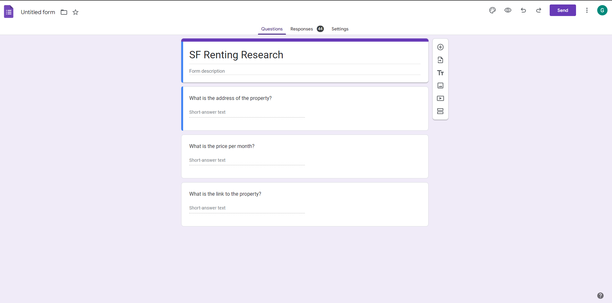
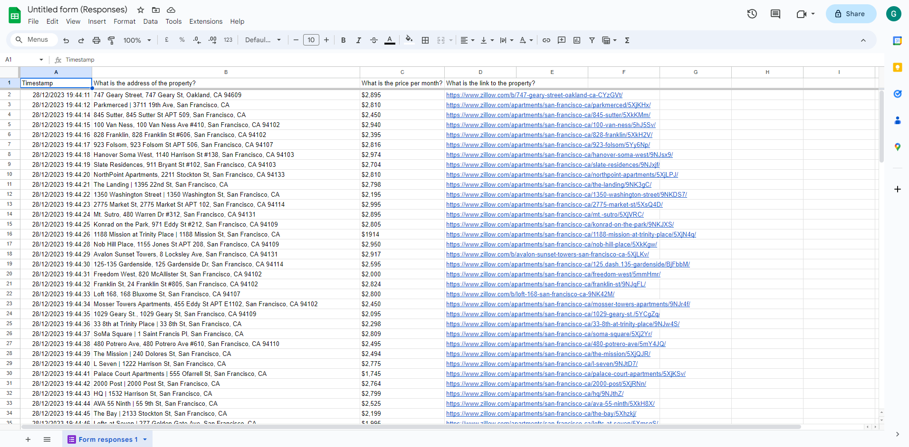

# Day 53 Project: Data Entry Job Automation

## Concept

This program works by web scraping a clone website from Zillow to get all the listings from a search previously
defined with the following parameters in the website: `apartments for rent in San Francisco CA, up to $3K, with 1+
bedrooms, and home type`. It might function for other queries as well. Then, it opens a custom Google Form and fills
in three inputs: 1. The address to the listing, 2. The price/month announced, and 3. The link to the listing. For each
listing, it sends the data as a new response. Finally, the user should open up the form and manually save the responses
as a spreadsheet. The following images should provide a visualization of the process.

Prior to executing the program, you should replace the constants in the code for the following items:

1. `FORM_URL` with the link to the form;
2. `FORM_INPUT_ADDRESS_XPATH` with the XPATH to the input element for the listing address.
3. `FORM_INPUT_PRICE_XPATH` with the XPATH to the input element for the listing price/month.
4. `FORM_INPUT_LINK_XPATH` with the XPATH to the input element for the listing link.
5. `FORM_BUTTON_SEND_XPATH` with the XPATH to the button element for the "Send/Submit" response in the form.
6. `FORM_LINK_SEND_ANOTHER_RESPONSE_XPATH` with the XPATH to the link element for the "Send/Submit another response" in the form (this element should appear in the page that opens after the response is sent).

The current implementation does not contain the `FORM_URL`, but the other constants have values for reference. They probably will not work by replacing only the form URL.
To make sure you copy the right XPATH of each element, click with the right button on the element and select Inspect, then click with the right button on the
element in the HTML section and then `copy XPATH`.

### Zillow search results

### Custom form example

### Results in spreadsheet

## Resources

### Libraries and Modules

- [Beautiful Soup Documentation](https://www.crummy.com/software/BeautifulSoup/bs4/doc/)
- [re - Regular expression operations](https://docs.python.org/3/library/re.html)
- [Requests: HTTP for Humans Documentation](https://requests.readthedocs.io/en/latest/)
- [The Selenium Browser Automation Project](https://www.selenium.dev/documentation/)

### Miscellanea

- [Zillow Clone Website](https://appbrewery.github.io/Zillow-Clone/)