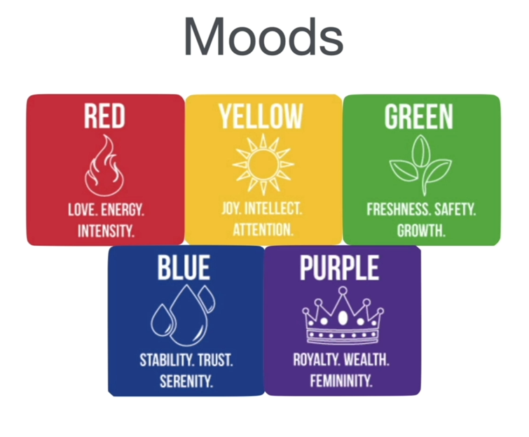

# Day 65 Studies: Web Design

This file is a quick introduction to Web Design that contains some concepts and theories as well as useful links for
more content related to web design.

## Web Design

> _"Web design encompasses many different skills and disciplines in the production and maintenance of websites. The different
areas of web design include web graphic design, user interface design (UI design); authoring, including standardised code
and proprietary software; user experience design (UX design); and search engine optimization (SEO)"_ - More on [Wikipedia](https://en.wikipedia.org/wiki/Web_design).

The four principles or pillars of web design are:

1. Colour Theory;
2. Typography;
3. User Interface Design (UI);
4. User Experience Design (UX).

## Colour Theory

In summary, [colour theory](https://en.wikipedia.org/wiki/Color_theory) is both the science and art of using colour. In web design, colours involve messages and induce
behaviour in a subtle manner. A specific and predominant colour combination produces visual effects and moods that should be consistent with
the message that the website wants to convey to its user.

Choosing a colour palette should be a conscious decision. Two popular approaches to this are: 1. Picking analogous colours
for harmonious designs, which may be appropriate for navigation bars or the body of a website; And 2. Complementary colours, which
may be appropriate to "pop" a specific element or make it stand out (e.g., a logo).

### Useful resources

- [Adobe Color Wheel](https://color.adobe.com/pt/create/color-wheel) - Colour combination and palette creator tool.
- [Color Hunt](https://colorhunt.co/) - Simple, ready-to-use colour palettes curated by professionals.

## Typography

> _"Typography is the art and technique of arranging type to make written language legible, readable, and appealing when
> displayed. The arrangement of type involves selecting typefaces, point sizes, line length, line spacing, letter spacing,
> and spaces between pairs of letters"_ - More on [Wikipedia](https://en.wikipedia.org/wiki/Typography)

In summary, it is important to select an adequate font for a website. As well as its colours, a website's collection
of fonts conveys a particular message and mood. The two most popular and important font families are **Serif** and
**Sans-serif**.

_Serif_ typefaces are useful to convey a more serious, old-style, authoritative or overall traditional mood.

_Sans-Serif_ typefaces are more related to friendly, contemporary, more approachable, or overall straightforward content.

The important outtakes for web design in relation to typography are:

- Use combinations in moderation. Generally, two fonts are enough.

- Respect the mood and time era: look for fonts that provide similar messages and do not carry that much contrast.

## User Interface Design

> "_User interface (UI) design or user interface engineering is the design of user interfaces for machines and software,
> such as computers, home appliances, mobile devices, and other electronic devices, with the focus on maximizing
> usability and the user experience_"—More on [Wikipedia](https://en.wikipedia.org/wiki/User_interface_design)

Important outtakes:

- **Layout is important**: breaking the content down into coherent blocks is better than bland and longer texts. An
ideal line of text should comprise 40–60 characters.

- **Use hierarchy to make the most important information stand out**. This can be done with different colours, element sizes, font families, font weight,
or just overall text position and alignment.

- **Reduce the number of alignment points.** The blocks will then look more well-designed and professional.

- **Use white spaces smartly.** A more minimalist approach in design can elevate a product or service by making it stand out.

- **Design for your audience.** Every layout stylization is relative. If Comic Sans is not an ideal font for scheduling a meeting,
it can be a fun concept for an invitation for events for children.

## User Experience Design

> "_The user experience (UX) is how a user interacts with and experiences a product, system, or service. It includes
> a person's perceptions of utility, ease of use, and efficiency. Improving user experience is important to most companies,
> designers, and creators when creating and refining products because negative user experience can diminish the use of the product
> and, therefore, any desired positive impacts (...)_-More on [Wikipedia](https://en.wikipedia.org/wiki/User_experience#:~:text=The%20user%20experience%20(UX)%20is,ease%20of%20use%2C%20and%20efficiency.)"

Five are the principles that drive the proper development of a good user experience:

1. Simplicity
2. Consistency
3. Reading Patterns (consider using the F or Z-design approaches)
4. All-platforms design
5. Do not induce the user towards viewing/using things they do not want ([dark pattern](https://en.wikipedia.org/wiki/Dark_pattern))

## Other resources

- [Canva](https://www.canva.com/) - Easily create, explore and get references for a variety of designs.
- [Daily UI](https://www.dailyui.co/) - A series of Design Challenges sent out every day to build up the design muscles.
- [Collect UI](https://collectui.com/) - Designs coming from the UI challenges from Daily UI (see above), updated daily.

## Practice example

- [L'Hotel Website](https://lhotel-design.my.canva.site/home) - A 3-page website draft I made in Canvas to practice the principles above.